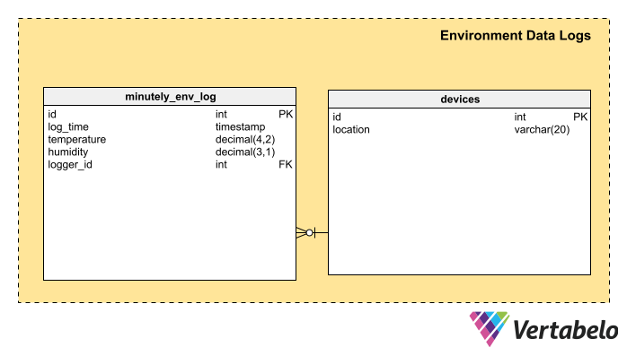

# README
This is quick practice for system design inspired by my recent projects. Found a nice tool to design database and here is the initial schema, very simple:

This README would normally document whatever steps are necessary to get the
application up and running.

Things you may want to cover:

* Ruby version: 3.0.1 Rails:6.1.3.2

* System dependencies

* Configuration

* Database creation

* Database initialization

* How to run the test suite

* Services (job queues, cache servers, search engines, etc.)

* Deployment instructions

* ...
